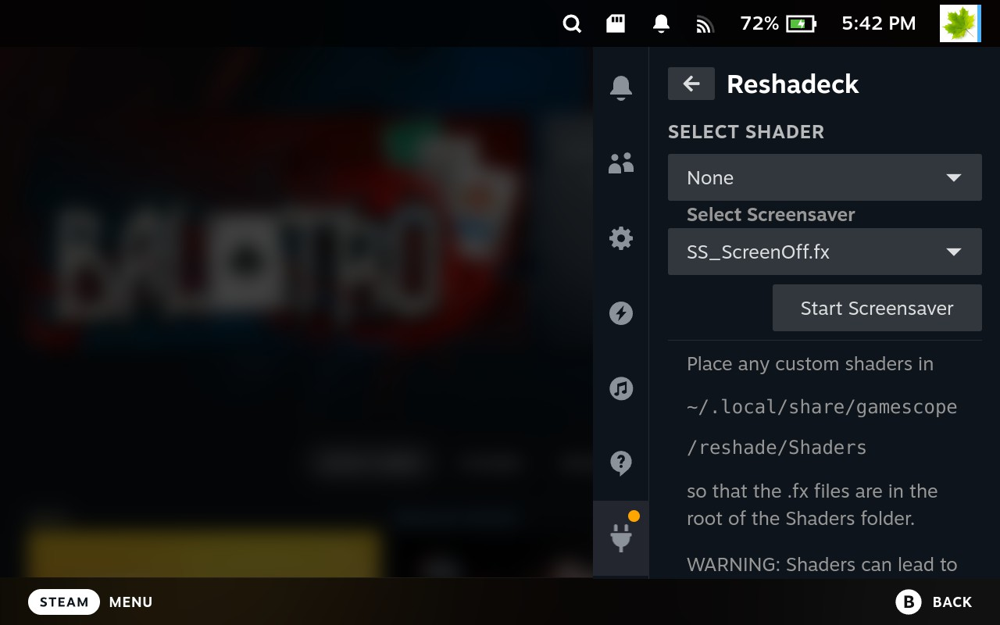

# Reshadeck
Reshade Shader Loader for Decky Plugin Loader for the handheld Steam Game Loader. It ships with a small curated set of shaders.
More shaders can be added at the `~/.local/share/gamescope/reshade/Shaders` folder such that the `.fx` files are in the 
root of the `Shaders` folder. Then you can pick and apply the shader using the plugin.

# Caveats
- Shaders can caused dropped frames in some rare cases and could also lead to severe performance degradation
- Shaders will not be applied at startup
- Screenshots will not contain the shader (but videos recorded via Decky Recorder will)
- When in game, the QAM menu will not have the shader applied
- When not in a game, the whole OS will have the shader applied
- You can't change any shader uniforms at run time. You have to edit the shader and change the default values
- Not all features of reshade are supported
- Some shaders can cause the Deck to crash

# A note on Deck OLED Fringing Patterns
The subpixel pattern of the Steam Deck OLED (Samsung screen at least), leads to some fringing that is visible to a small minority of people.
It is possible to [largely eliminate this fringing](https://gist.github.com/safijari/1b936cbbdebe341fbe340bcfecb04450) using a shader. That 
shader is included by default in this plugin.

# Places to find more shaders

https://github.com/Matsilagi/RSRetroArch/tree/main/Shaders

https://framedsc.com/ReshadeGuides/shaderscatalogue.htm
